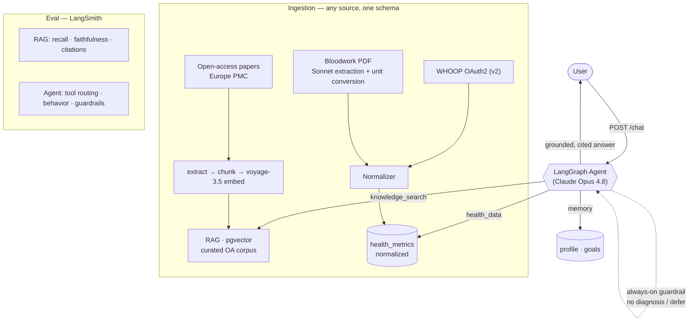

# Personal Health Strategist

An **agentic RAG** application that turns your own body data — WHOOP recovery/sleep,
bloodwork labs — into a science-grounded, personalized health strategy. Every answer
is grounded in peer-reviewed sports-science research **with citations**, and a
LangGraph agent decides which tools to use per question.

> Portfolio project demonstrating production-shaped AI engineering: RAG done properly,
> agent orchestration, a normalized data-ingestion layer, and **measured** quality
> (retrieval + agent evals in LangSmith).

---

## Architecture



## What it does

- **Agentic RAG.** A LangGraph agent (built on LangGraph v1's `create_agent`) orchestrates
  four tools — `knowledge_search` (RAG over the research corpus), `health_data` (your
  normalized WHOOP + bloodwork metrics), `workouts` (your logged WHOOP training sessions),
  and `memory` (your profile/goals). It decides which to call per question and loops until
  it can answer, with conversation state persisted in Postgres so threads survive restarts
  and scale-to-zero. A **guardrail policy** (never diagnose, defer red flags) wraps every
  response.
- **"Any source, one schema" ingestion.** WHOOP (live OAuth2) and bloodwork PDFs both
  normalize into a single `health_metrics` shape (`source · date · metric_type · value ·
  unit`). Bloodwork values are extracted from messy lab PDFs by Claude with **unit
  conversion** to canonical units.
- **Grounded answers with citations.** Retrieval over a curated open-access sports-science
  & physical-health corpus (**~4,200 papers / 275k passages** from Europe PMC, voyage-3.5
  embeddings in pgvector); answers cite their sources and admit when the corpus doesn't
  cover a topic.
- **Measured quality.** Golden-set evals in LangSmith for both the RAG pipeline and the
  agent's behavior.

## Eval baselines (LangSmith)

Two things had to be repaired before these numbers meant anything: the judges were
fabricating scores, and the golden sets still encoded assumptions from the original
13-paper corpus. Both are fixed below. Current baselines, Sonnet generator (what
`/ask` serves), Haiku judge:

| RAG metric (`scripts/eval.py`) | v1 · 13 papers | v2 · 4.2k<br>broken judge | v3 · 4.2k<br>judge fixed | **v3 · + recalibrated set** |
|---|---|---|---|---|
| recall@k | 1.00 | 0.75 | 0.75 | **0.96** (n=24) |
| citation_validity | 1.00 | 1.00 | 1.00 | **1.00** |
| faithfulness | 0.92 | 0.52 | 0.97 | **1.00** |
| correctness | 0.88 | 0.81 | 0.87 | **0.97** |

**Agent** (`scripts/eval_agent.py`): tool routing **1.00** (n=14) · behavior
correctness **1.00** (n=19). Every score carries its `n` because an unscorable case
is recorded as unscored, never as a 0 — see below.

### The v2 numbers were wrong, and finding out was the useful part

`faithfulness` 0.52 was not a quality signal, it was a **broken evaluator**. The judge
was asked for a bare digit at `max_tokens=8`; when it reasoned through the claims
instead it ran out of budget mid-sentence, never wrote its verdict, and the parser
scavenged the last `0` or `1` out of prose dense with `[1]`, `20%` and `1992`. **18 of
31 scores were assigned that way.** The judges now reason first and close with a
mandatory verdict line, the rationale is attached to the score as the evaluator's
comment so a failing case explains itself in the trace, and an unparseable verdict
scores `None` rather than a guess.

**How noisy is a 31-case LLM-judged set?** Measured, not assumed: Opus `correctness`
read **0.87 → 0.81 → 0.77** across three runs over *identical cached answers*, with
only the judge re-sampled. Treat sub-10-point differences on sets this size as noise.

### Recalibrating the golden sets for the corpus they now run against

Both sets were written for 13 papers and were quietly penalising correct behaviour:

- **`expected_source` was a single pinned DOI.** At 4,200 papers several papers
  legitimately answer a question, so `recall@k` scored 0 whenever retrieval surfaced a
  different-but-equally-valid one. `scripts/recalibrate_golden.py` widens it to
  `expected_sources` by **pooling** (the method IR benchmarks have used for decades):
  candidates come from two independent retrieval arms — dense vector search *and*
  lexical matching — and each is admitted or rejected by a judge reading its passages,
  with rank withheld. A paper qualifies because it answers the question, never because
  retrieval ranked it highly, so `recall@k` still asks something the retriever can
  fail. It landed at 0.96, not 1.00.
- **The "out-of-corpus" cases were no longer out of corpus.** Three cases expected the
  system to say it had nothing on beta-alanine, marathon pacing or BCAAs; the corpus
  holds 54, 9 and 196 papers on them. They were replaced with topics it genuinely
  cannot answer, taken from what `data/corpus_topics.yml` deliberately excludes and
  verified by chunk count: elevation training masks (0 papers), nootropics (1),
  pediatric resistance training (2).

**The replacements immediately caught a real defect — and it is now fixed.** Three
agent cases failed because **the agent did not reliably admit missing evidence**:
asked about training masks it searched, found nothing on them, and answered with
unsupported specifics; asked to program training for a 12-year-old it searched four
times and produced a detailed programme; asked for a VO2max it does not track, it
reported a number — fabricating a value for the user's own health metric, the
highest-severity failure this project can produce. The stale set could see none of
this.

The obvious fix does not work, and measuring said so: a similarity floor cannot
separate covered from uncovered topics, because top-1 cosine for "nootropics"
(0 papers) is **0.638** while well-covered "sleep extension" is **0.627**. The
distributions overlap — cosine from a bi-encoder is a relative ranking signal, not
calibrated relevance. So the fix makes the absence legible instead: `knowledge_search`
appends an explicit note that passages are ALWAYS returned and are not evidence of
coverage, and `health_data` answers a miss by naming the metrics that *are* tracked
rather than a bare "no data". Behavior correctness went 0.84 → **1.00**, with the
three cases now opening "the corpus doesn't contain a study on…" and then giving only
what they can actually support.

### What these numbers do and don't prove

They're small, self-authored *development* sets — smoke tests, not generalization
claims. `faithfulness` / `correctness` are LLM-judged by a **different family** than
the generator (`claude-haiku-4-5` — independent of both the Sonnet RAG generator and
the Opus agent) to blunt self-preference bias.

Two honest limits on the numbers above. **`recall@k` is close to saturated**: at 0.96
it is now good for catching regressions but has almost no headroom to demonstrate an
improvement, so measuring a reranker needs a rank-sensitive metric (MRR or nDCG),
which is the next thing to add. And a widened answer key makes the metric *correct*,
not *harder* — the honest reading is that retrieval reliably surfaces at least one
valid paper, while how well it **ranks** them is still unmeasured.

### Running the harnesses cheaply

- **Free retrieval tier.** `scripts/eval.py --retrieval-only` scores `recall@k`
  over Voyage retrieval with **no Anthropic spend** (embeddings are a separate
  provider) — use it to iterate on retrieval/chunking for free.
- **Response cache.** Set `LLM_CACHE_DIR=.llm-cache` to memoize generations and
  judge verdicts by request hash, so re-runs while you tweak scoring cost nothing
  (and become deterministic). Leave unset in production.
- **Model config.** `RAG_GEN_MODEL`, `AGENT_MODEL`, `EVAL_GEN_MODEL`, and
  `EVAL_JUDGE_MODEL` (see `.env.example`) let you run cheap smoke passes on Haiku
  and reserve Opus for reported baselines.

## Tech stack

FastAPI · PostgreSQL + pgvector · Claude (Opus 4.8 agent, Sonnet 5 RAG answers +
bloodwork extraction, Haiku 4.5 eval judge) · Voyage `voyage-3.5` embeddings · LangGraph + LangChain + LangSmith ·
WHOOP OAuth2 · PyMuPDF · Docker Compose · a thin static chat UI (Next.js is a documented
future upgrade).

## Deployment

Running on **Azure Container Apps** (Poland Central) with managed PostgreSQL 16 + pgvector,
the image pulled from Azure Container Registry via managed identity, and secrets in the
Container Apps secret store. Full runbook — deploy loop, DB seeding, cost controls,
gotchas — in [DEPLOY.md](DEPLOY.md).

**Accounts.** Email + password (argon2id) or Google / Microsoft sign-in, with email
verification as a dismissible reminder (never a lockout) and a self-serve password reset. Sessions are
server-side and revocable. Anyone can also pick **"Try Health Strategist now"** for a guest
session that reads a sample dataset and saves nothing. Every write endpoint derives the user
from the session, and WHOOP is connected per-account.

**Cost guardrails.** The endpoints that spend on the app's own API keys are rate-limited
(`app/ratelimit.py`): the agent per signed-in account and, more tightly, per IP for guests;
the public `/ask` and `/search` per IP. A stranger who finds the URL can't turn it into
unbounded Anthropic spend, and the ceilings are tunable via `RATE_*` env vars.

**Observability.** Container logs stream to a Log Analytics workspace (queryable via KQL),
and a scheduled GitHub Action (`scripts/prod_smoke_eval.py`) runs a daily black-box
smoke-eval against the live app — liveness, retrieval recall, and (on demand) `/ask`
citation validity — so the "measured quality" story extends past the local golden sets to
*production*. Details in [DEPLOY.md](DEPLOY.md#observability-logs--a-production-canary).

## Quickstart

```bash
# 1. configure secrets
cp .env.example .env          # then fill in the API keys

# 2. start the stack (FastAPI + Postgres/pgvector)
docker compose up -d --build

# 3. build the corpus
#    a) apply DB migrations (idempotent, tracked in schema_migrations; safe on a fresh DB
#       too — it baselines the schema init_db.sql already created)
docker compose exec api python scripts/migrate.py
#    b) fetch open-access papers from Europe PMC (data/corpus_topics.yml is the recipe).
#       --slice N caps each pillar for a smoke test; drop it for the full ~4k run.
docker compose exec api python scripts/fetch_corpus.py --slice 15
#    c) extract → chunk/ingest → embed
docker compose exec api python scripts/extract_text.py
docker compose exec api python scripts/ingest.py
docker compose exec api python scripts/embed_chunks.py
#    d) build the ANN index once embeddings exist
cat scripts/index_corpus.sql | docker compose exec -T db psql postgresql://phs:phs@db:5432/phs

# 4. open the chat UI
open http://localhost:8000
```

Connect WHOOP: register `http://localhost:8000/whoop/callback` as a redirect URI in your
WHOOP app, then visit `http://localhost:8000/whoop/connect?user_id=1`.

## API

| Method | Path | Purpose |
|---|---|---|
| GET | `/` · `/login` · `/onboarding` | Chat UI, sign-in page, first-run setup |
| POST | `/chat` | Talk to the agent (`{message, thread_id?}`) |
| POST | `/ask` | Fixed RAG pipeline: retrieve → cited answer |
| POST | `/search` | Retrieval only (no LLM) |
| POST | `/auth/register` · `/auth/login` · `/auth/logout` | Accounts |
| GET | `/auth/oauth/{google\|microsoft}/start` · `/callback` | External sign-in |
| GET | `/auth/verify` · POST `/auth/forgot-password` · `/auth/reset-password` | Email flows |
| POST | `/auth/guest` | Start a read-only guest session |
| POST | `/metrics` · GET `/metrics/{id}` | Ingest / query normalized metrics |
| POST | `/upload/bloodwork` | Upload a lab PDF → extracted metrics |
| GET | `/whoop/connect` · `/whoop/callback` | WHOOP OAuth2 (per account) |

## Evals

```bash
docker compose exec api python scripts/eval.py         # RAG
docker compose exec api python scripts/eval_agent.py   # agent
```

## Project layout

```
app/        FastAPI app, agent, tools, ingestion, WHOOP, bloodwork, static UI
scripts/    init/migrate SQL, extract/ingest/embed, eval harnesses
data/       sources.md (corpus manifest) + eval golden sets
```

## Notes

Corpus source files, the derived plain text, and `.env` are gitignored — the repo tracks
code, the source manifest, and the eval sets. Open-access (CC BY) research only.
