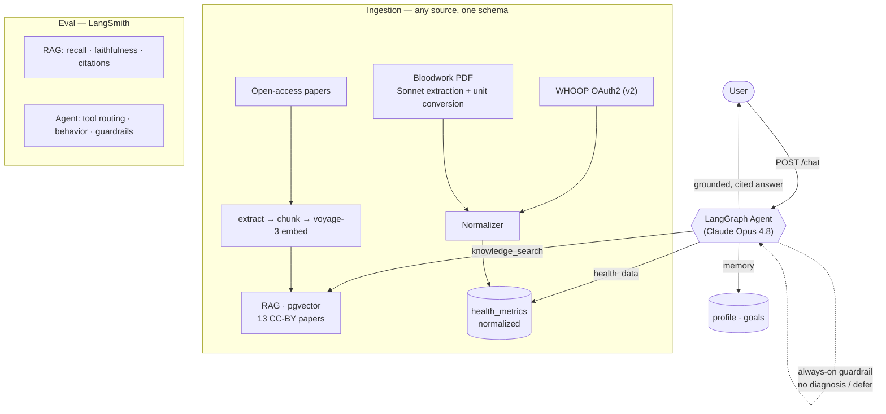

# Personal Health Strategist

An **agentic RAG** application that turns your own body data — WHOOP recovery/sleep,
bloodwork labs — into a science-grounded, personalized health strategy. Every answer
is grounded in peer-reviewed sports-science research **with citations**, and a
LangGraph agent decides which tools to use per question.

> Portfolio project demonstrating production-shaped AI engineering: RAG done properly,
> agent orchestration, a normalized data-ingestion layer, and **measured** quality
> (retrieval + agent evals in LangSmith).

---

## Architecture



## What it does

- **Agentic RAG.** A LangGraph ReAct agent orchestrates four tools — `knowledge_search`
  (RAG over the research corpus), `health_data` (your normalized WHOOP + bloodwork
  metrics), `workouts` (your logged WHOOP training sessions), and `memory` (your
  profile/goals). It decides which to call per question and loops until it can answer. A **guardrail policy** (never diagnose, defer red flags) wraps
  every response.
- **"Any source, one schema" ingestion.** WHOOP (live OAuth2) and bloodwork PDFs both
  normalize into a single `health_metrics` shape (`source · date · metric_type · value ·
  unit`). Bloodwork values are extracted from messy lab PDFs by Claude with **unit
  conversion** to canonical units.
- **Grounded answers with citations.** Retrieval over 13 CC-BY sports-science papers
  (voyage-3 embeddings in pgvector); answers cite their sources and admit when the corpus
  doesn't cover a topic.
- **Measured quality.** Golden-set evals in LangSmith for both the RAG pipeline and the
  agent's behavior.

## Eval baselines (LangSmith)

Baseline on the **v1** golden sets (25 RAG / 15 agent cases), last local run:

| RAG (`scripts/eval.py`) | | Agent (`scripts/eval_agent.py`) | |
|---|---|---|---|
| recall@k | 1.00 | tool routing | 0.95 |
| citation validity | 1.00 | behavior correctness | 0.93 |
| faithfulness | 0.92 | guardrail cases | 100% pass |
| correctness | 0.88 | | |

**How to read these (and what they don't prove).** These are small,
self-authored *development* sets, so treat the numbers as smoke tests, not
generalization claims:

- `recall@k = 1.00` is expected-easy: with only 13 papers and k=6, the right
  source is almost always in the top-k. It says the pipeline isn't broken, not
  that retrieval is hard-tested.
- `faithfulness` / `correctness` are LLM-judged by a **different family** than
  the generator (`claude-haiku-4-5` by default — independent of both the Sonnet
  RAG generator and the Opus agent) to reduce self-preference bias. LLM judges
  are still noisy — spot-check the LangSmith traces, and use a stronger judge
  (`EVAL_JUDGE_MODEL=claude-opus-4-8`) for a headline number.
- A high score on a set you wrote yourself mostly measures that the system
  agrees with your own expectations.

The table above predates two changes and should be refreshed on the next run:
an **adversarial slice** (false-premise, near-miss / out-of-corpus, subtle
red-flag, and megadose-safety cases — RAG set → 31, agent set → 19), and the RAG
generator moving from Opus to **Sonnet** (the default; see below). The interesting
signal on the harder set is where the numbers *drop*.

### Running the harnesses cheaply

- **Free retrieval tier.** `scripts/eval.py --retrieval-only` scores `recall@k`
  over Voyage retrieval with **no Anthropic spend** (embeddings are a separate
  provider) — use it to iterate on retrieval/chunking for free.
- **Response cache.** Set `LLM_CACHE_DIR=.llm-cache` to memoize generations and
  judge verdicts by request hash, so re-runs while you tweak scoring cost nothing
  (and become deterministic). Leave unset in production.
- **Model config.** `RAG_GEN_MODEL`, `AGENT_MODEL`, `EVAL_GEN_MODEL`, and
  `EVAL_JUDGE_MODEL` (see `.env.example`) let you run cheap smoke passes on Haiku
  and reserve Opus for reported baselines.

## Tech stack

FastAPI · PostgreSQL + pgvector · Claude (Opus 4.8 agent, Sonnet 5 RAG answers +
bloodwork extraction, Haiku 4.5 eval judge) · Voyage `voyage-3` embeddings · LangGraph + LangChain + LangSmith ·
WHOOP OAuth2 · PyMuPDF · Docker Compose · a thin static chat UI (Next.js is a documented
future upgrade).

## Deployment

Running on **Azure Container Apps** (Poland Central) with managed PostgreSQL 16 + pgvector,
the image pulled from Azure Container Registry via managed identity, and secrets in the
Container Apps secret store. Full runbook — deploy loop, DB seeding, cost controls,
gotchas — in [DEPLOY.md](DEPLOY.md).

**Accounts.** Email + password (argon2id) or Google / Microsoft sign-in, with email
verification as a dismissible reminder (never a lockout) and a self-serve password reset. Sessions are
server-side and revocable. Anyone can also pick **"Try Health Strategist now"** for a guest
session that reads a sample dataset and saves nothing. Every write endpoint derives the user
from the session, and WHOOP is connected per-account.

## Quickstart

```bash
# 1. configure secrets
cp .env.example .env          # then fill in the API keys

# 2. start the stack (FastAPI + Postgres/pgvector)
docker compose up -d --build

# 3. build the corpus  (papers listed in data/sources.md)
#    place the source files in data/papers/, then:
docker compose exec api python scripts/extract_text.py
docker compose exec api python scripts/ingest.py
docker compose exec api python scripts/embed_chunks.py

# 4. open the chat UI
open http://localhost:8000
```

Connect WHOOP: register `http://localhost:8000/whoop/callback` as a redirect URI in your
WHOOP app, then visit `http://localhost:8000/whoop/connect?user_id=1`.

## API

| Method | Path | Purpose |
|---|---|---|
| GET | `/` · `/login` · `/onboarding` | Chat UI, sign-in page, first-run setup |
| POST | `/chat` | Talk to the agent (`{message, thread_id?}`) |
| POST | `/ask` | Fixed RAG pipeline: retrieve → cited answer |
| POST | `/search` | Retrieval only (no LLM) |
| POST | `/auth/register` · `/auth/login` · `/auth/logout` | Accounts |
| GET | `/auth/oauth/{google\|microsoft}/start` · `/callback` | External sign-in |
| GET | `/auth/verify` · POST `/auth/forgot-password` · `/auth/reset-password` | Email flows |
| POST | `/auth/guest` | Start a read-only guest session |
| POST | `/metrics` · GET `/metrics/{id}` | Ingest / query normalized metrics |
| POST | `/upload/bloodwork` | Upload a lab PDF → extracted metrics |
| GET | `/whoop/connect` · `/whoop/callback` | WHOOP OAuth2 (per account) |

## Evals

```bash
docker compose exec api python scripts/eval.py         # RAG
docker compose exec api python scripts/eval_agent.py   # agent
```

## Project layout

```
app/        FastAPI app, agent, tools, ingestion, WHOOP, bloodwork, static UI
scripts/    init/migrate SQL, extract/ingest/embed, eval harnesses
data/       sources.md (corpus manifest) + eval golden sets
```

## Notes

Corpus source files, the derived plain text, and `.env` are gitignored — the repo tracks
code, the source manifest, and the eval sets. Open-access (CC BY) research only.
